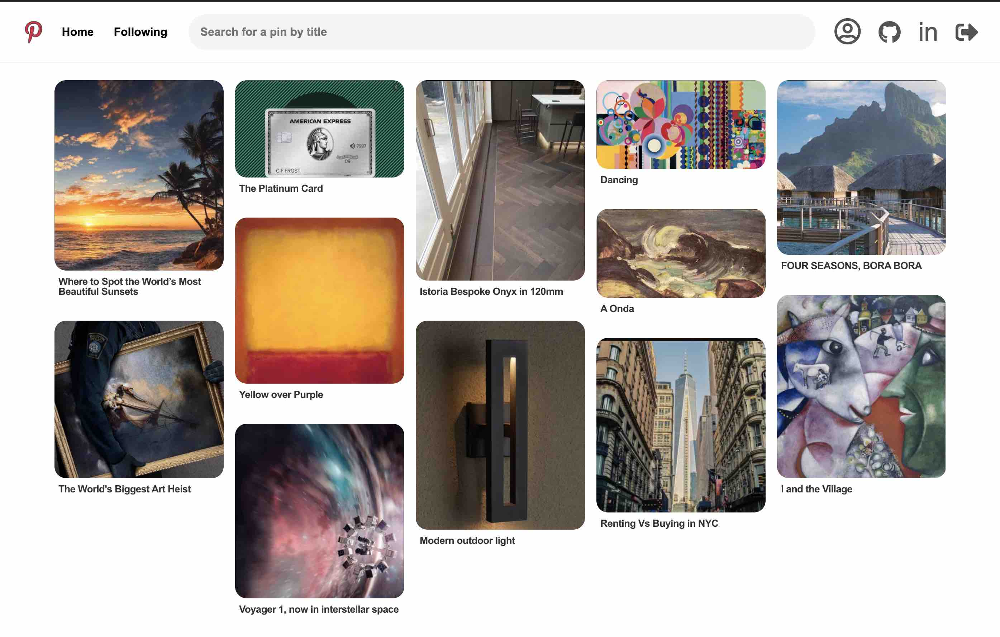

# README

# [Clone Pinterest](https://clone-pinterest.herokuapp.com/#/) 
Pinterest is a social media application for inspiration based on image sharing. [Pinterest](https://www.pinterest.com/) designed to enable user to discover information and ideas on the internet using images.

Clone Pinterest is built on a Ruby on Rails backend, utilizing PostgreSQL and AWS S3 for data storage. React and Redux are the main libraries used for the frontend, along with HTML and CSS, with Heroku used for app deployment.

    

## Features
* User Authentication built using backend Rails validations with regex and secure BCrypt password hashing
* Logged in users can complete full CRUD cycle for Boards and Pins and save other users' Pins
* Optimized minimal server load with cloud-based image storage via Rails ActiveStorage and Amazon Web Services S3

## Technologies Used:
* Ruby on Rails
* JBuilder
* JavaScript
* React.js
* Redux.js
* HTML/CSS
* PostgreSQL
* Amazon Web Services (AWS S3)
* Heroku

## Additional Resources
* <a href="https://github.com/Vladimir-19/Pinterest/blob/main/db/schema.rb">Schema</a>
* <a href="https://github.com/Vladimir-19/Pinterest/blob/main/db/seeds.rb">Seeds</a>
* <a href="https://github.com/Vladimir-19/Pinterest/blob/main/config/routes.rb">Backend routes</a>

## Future Plans
* Follows
* Comments
* Tags
* Notifications

